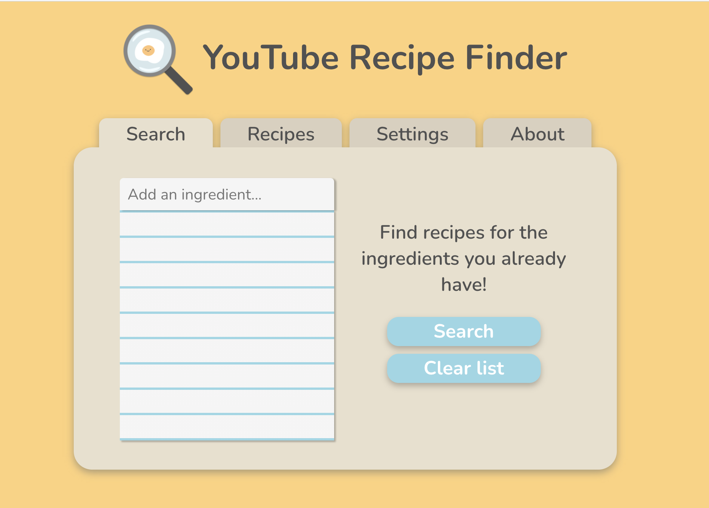

# YouTube Recipe Finder

<p align="center">


### Made with React, Node.js, and YouTube API v3.
  #### 📐 [Design](#design) <br/>
  #### [🚀 Future plans / 🐛 Known bugs](#future-plans--known-bugs) <br/>
  #### 🔮 [Try it!](#try-it)
  #### 📕 [Resources consulted](#resources-consulted) <br/>
  #### 🥐 [Cooking channel recommendations](#-bon-appétit) <br/>
</p>

<br/>

<p align="center">
  
  
  <br/>
  
  
  
  
  
</p>

## Design

Designed and 'prototyped' in Figma; bootstrapped with [heroku-cra-node](https://github.com/mars/heroku-cra-node). <br/>


### Frontend

- React
- vanilla HTML/CSS
- local storage to cache user data and search results

### Backend

- Node.js, Express
- YouTube API v3
- [Async module](https://caolan.github.io/async/v3/)

### Flow

Data is stored in local storage, sent to the backend in a POST request, then the backend answers with the search results which are cached and processed to display. When the user updates data, a flag is set to indicate that the results are no longer up-to-date.

To add a channel, the URL is first sent to the backend for validation, with additional useful information returned if the URL is valid.

To search, an async while loop (`async/until`) grabs all the videos from each channel's master 'Uploads from X' playlist (e.g. https://www.youtube.com/playlist?list=UU84Zkx_92divh3h4sKXeDew). It's just array and string manipulation from there on out!

(In hindsight, I could have probably used some form of native JavaScript `async/await` with a `for` loop, but I didn't even know what that was when I wrote the search endpoint 😛)

## Future Plans / Known Bugs

- Deploying to Heroku (after I try to minimize API calls. It adds up fast 😪)
- /c/ type YouTube channel URLs do not work - not supported in YouTube API and I couldn't make the workaround work.

## Try it

This section is adapted from the original `heroku-cra-node` [README](https://github.com/mars/heroku-cra-node#user-content-local-development).

Because this app is made of two npm projects, there are two places to run `npm` commands:

1. **Node API server** at the root `./`.
1. **React UI** in `react-ui/` directory.

### Run the API server

Grab an API key for the YouTube API from [Google Cloud Platform](https://console.cloud.google.com/) and place it in an `.env` file in the root of the repo like so:
```
TOKEN=abc123secretKey
```

In a terminal:

```bash
# Initial setup
npm install

# Start the server
# Option 1: npm
npm start

# Option 2: nodemon
nodemon server/
```

### Run the React UI

In a separate terminal from the API server, start the UI:

```bash
cd react-ui/
npm install
npm start
```

### Install new npm packages

```bash
## For Node
npm install package-name --save

## For React UI
cd react-ui/
npm install package-name --save
```

### My new favorite tools
- [Insomnia Core](https://insomnia.rest/), a Desktop API Client to test your API endpoints
- Chrome DevTools - `⌘`+`Option`+`I` / `Ctrl`+`Shift`+`I`
  - Debug CSS: Inspect element > Styles
  - Local Storage: Open Inspector > in top navbar, Application > Local Storage > sitename

## Resources Consulted
- [Traversy Media - React JS Crash Course](https://www.youtube.com/watch?v=sBws8MSXN7A)
- [FreeCodeCamp.org - Learn the Mern Stack by Beau Carnes](https://www.youtube.com/watch?v=7CqJlxBYj-M)
- [General approach to fetching all videos from a YouTube channel](https://stackoverflow.com/questions/18953499/youtube-api-to-fetch-all-videos-on-a-channel/27872244#27872244)
- [React SPA local storage](https://medium.com/@siobhanpmahoney/local-storage-in-a-react-single-page-application-34ba30fc977d)
- [🦓 CSS stripes](https://css-tricks.com/stripes-css/)
- [Parsing URLs in JS](https://dmitripavlutin.com/parse-url-javascript/)
- ...and many more

## 🥘 Bon Appétit!
### Check out the cooking channels in the pictures~
- [서담SEODAM](https://www.youtube.com/channel/UC84Zkx_92divh3h4sKXeDew)
- [Nino's Home](https://www.youtube.com/channel/UCKetFmtqdh-kn915crdf72A)
- [Cooking with Dog](https://www.youtube.com/user/cookingwithdog)
- [Food Wishes](https://www.youtube.com/user/foodwishes)
- [Binging with Babish](https://www.youtube.com/channel/UCJHA_jMfCvEnv-3kRjTCQXw)
